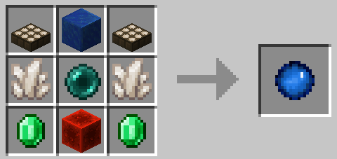
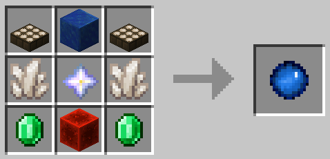
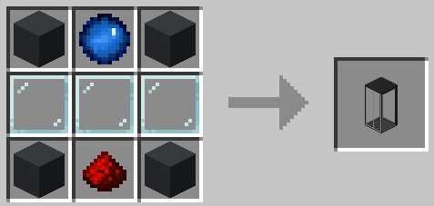
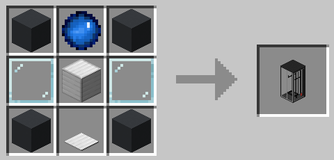
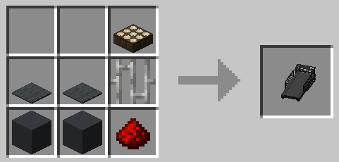
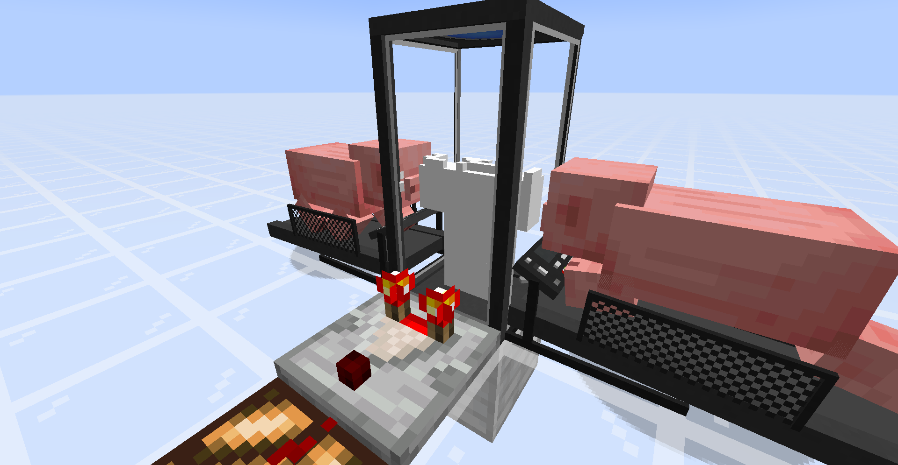
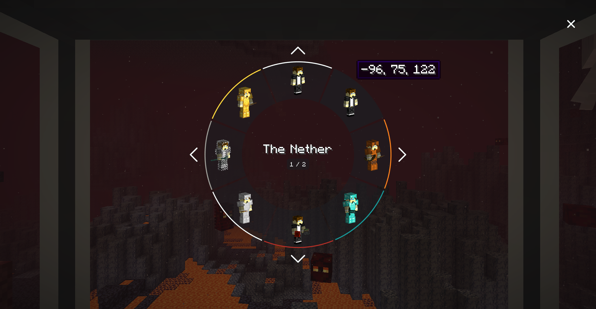

# Sync (Fabric)
[](https://github.com/Kir-Antipov/sync-fabric/releases/latest)
[](https://github.com/Kir-Antipov/sync-fabric/actions/workflows/build-artifacts.yml)
[![Modrinth](https://img.shields.io/badge/dynamic/json?color=5da545&label=Modrinth&query=title&url=https://api.modrinth.com/api/v1/mod/sync-fabric&style=flat&cacheSeconds=3600&logo=data:image/svg+xml;base64,PHN2ZyB4bWxucz0iaHR0cDovL3d3dy53My5vcmcvMjAwMC9zdmciIHZpZXdCb3g9IjAgMCAxMSAxMSIgd2lkdGg9IjE0LjY2NyIgaGVpZ2h0PSIxNC42NjciICB4bWxuczp2PSJodHRwczovL3ZlY3RhLmlvL25hbm8iPjxkZWZzPjxjbGlwUGF0aCBpZD0iQSI+PHBhdGggZD0iTTAgMGgxMXYxMUgweiIvPjwvY2xpcFBhdGg+PC9kZWZzPjxnIGNsaXAtcGF0aD0idXJsKCNBKSI+PHBhdGggZD0iTTEuMzA5IDcuODU3YTQuNjQgNC42NCAwIDAgMS0uNDYxLTEuMDYzSDBDLjU5MSA5LjIwNiAyLjc5NiAxMSA1LjQyMiAxMWMxLjk4MSAwIDMuNzIyLTEuMDIgNC43MTEtMi41NTZoMGwtLjc1LS4zNDVjLS44NTQgMS4yNjEtMi4zMSAyLjA5Mi0zLjk2MSAyLjA5MmE0Ljc4IDQuNzggMCAwIDEtMy4wMDUtMS4wNTVsMS44MDktMS40NzQuOTg0Ljg0NyAxLjkwNS0xLjAwM0w4LjE3NCA1LjgybC0uMzg0LS43ODYtMS4xMTYuNjM1LS41MTYuNjk0LS42MjYuMjM2LS44NzMtLjM4N2gwbC0uMjEzLS45MS4zNTUtLjU2Ljc4Ny0uMzcuODQ1LS45NTktLjcwMi0uNTEtMS44NzQuNzEzLTEuMzYyIDEuNjUxLjY0NSAxLjA5OC0xLjgzMSAxLjQ5MnptOS42MTQtMS40NEE1LjQ0IDUuNDQgMCAwIDAgMTEgNS41QzExIDIuNDY0IDguNTAxIDAgNS40MjIgMCAyLjc5NiAwIC41OTEgMS43OTQgMCA0LjIwNmguODQ4QzEuNDE5IDIuMjQ1IDMuMjUyLjgwOSA1LjQyMi44MDljMi42MjYgMCA0Ljc1OCAyLjEwMiA0Ljc1OCA0LjY5MSAwIC4xOS0uMDEyLjM3Ni0uMDM0LjU2bC43NzcuMzU3aDB6IiBmaWxsLXJ1bGU9ImV2ZW5vZGQiIGZpbGw9IiM1ZGE0MjYiLz48L2c+PC9zdmc+)](https://modrinth.com/mod/sync-fabric)
[](https://www.curseforge.com/minecraft/mc-mods/sync-fabric)
[](https://github.com/Kir-Antipov/sync-fabric#readme)

[Sync (Fabric)](https://github.com/Kir-Antipov/sync-fabric) is an unofficial reimplementation of the original [Sync](https://github.com/iChun/Sync) mod, developed by [iChun](https://github.com/iChun).

As for the brief description of the mod, I think the original one says it all:

> This mod provides clones, or as we like to call it, "shells". These shells are basically new individuals, with their own inventory, experience level, and even gamemode.
> \
> \
> However, they lack a mind that would control them. That's where the player comes in. Each shell is biometrically tied to the player whose sample was used to create it, and allows the player to "sync" their mind with it, essentially creating multiple player instances.

----

## Crafting recipes

#### Sync Core:



#### Sync Core (for Hardcore players):



P.S. - If you aren't brave enough to fight the Wither in Hardcore, you can use [this datapack](media/simplified_hardcore_recipe_datapack.zip) *(it will bring back the original Sync Core recipe)*. Please read [this article](https://minecraft.fandom.com/wiki/Tutorials/Installing_a_data_pack), if you don't know how to do it.

#### Shell Constructor:



#### Shell Storage:



#### Treadmill:



----

## How to play

 1. You need to craft a `shell constructor` and place it down.
 2. Then you need to provide it with a sample - just `right-click` the thing.\
 **⚠️WARNING: this action will kill you!** In order to create a shell with full health, the constructor must absorb 20HP *(40 for Hardcore players)*. If you don't want to die, you can eat a golden apple to increase your maximum health, or you can hold a totem of undying during the process *(which is the only option for Hardcore players)*.
 3. The shell constructor needs power to work, so put a `treadmill` next to it *(it should touch any side of any part of the shell constructor)* and lure a `pig` or a `wolf` to its center to start generating piggawatts.\
 You should end up with something like this:
 \
 <sub>You don't really need a comparator, it's here just to demonstrate that you can determine progress of the shell construction process via strength of the comparator output.</sub>
 4. Once your new shell is constructed, you need to craft a `shell storage` and place it down.
 5. Supply it with `redstone power`.
 6. Once doors of the shell storage are open, you can `walk into it`.
 7. You'll see a radial `menu` that displays your shells:
 
 8. `Select` the shell you want to transfer your mind into, and enjoy the process!

 ## Notes

  - You can color-code shells stored in shell storages. Just right-click a shell storage with dye.
  - Syncing works cross dimensional, and should support custom dimensions.
  - If you die while using a shell, you'll be immediately synced with your original body *(if you still have one; otherwise your mind will be transferred to a random shell)*.
  - Death of a shell doesn't increase your death counter.
  - Shell storage should be constantly supplied with redstone power in order to keep stored shell alive.
  - Shell storage and shell constructor are pretty fragile, so don't try to mine them without `silk touch` enchantment.

----

## Installation

Requirements:
 - Minecraft `1.17.x`
 - Fabric Loader `>=0.11.3`
 - Fabric API `>=0.39.0`

You can download the mod from:

 - [GitHub Releases](https://github.com/Kir-Antipov/sync-fabric/releases/) <sup><sub>(recommended)</sub></sup>
 - [Modrinth](https://modrinth.com/mod/sync-fabric)
 - [CurseForge](https://www.curseforge.com/minecraft/mc-mods/sync-fabric)
 - [GitHub Actions](https://github.com/Kir-Antipov/sync-fabric/actions/workflows/build-artifacts.yml) *(these builds may be unstable, but they represent the actual state of the development)*

## Building from sources

Requirements:
 - JDK `16`
 - `GITHUB_ACTOR` *(GitHub login)* project property/environment variable
 - `GITHUB_TOKEN` project property/environment variable. Required scopes: `read:packages`

### Linux/MacOS

```cmd
git clone https://github.com/Kir-Antipov/sync-fabric.git
cd sync-fabric

chmod +x ./gradlew
./gradlew build
cd build/libs
```
### Windows

```cmd
git clone https://github.com/Kir-Antipov/sync-fabric.git
cd sync-fabric

gradlew build
cd build/libs
```

----

## License

Created by [Kir_Antipov](https://github.com/Kir-Antipov), licensed under MIT license.\
Originally made by [iChun](https://github.com/iChun) under GNU LGPLv3 license.

```
Copyright (C) 2021 Kir_Antipov

Permission is hereby granted, free of charge, to any person obtaining a copy
of this software and associated documentation files (the "Software"), to deal
in the Software without restriction, including without limitation the rights
to use, copy, modify, merge, publish, distribute, sublicense, and/or sell
copies of the Software, and to permit persons to whom the Software is
furnished to do so, subject to the following conditions:

The above copyright notice and this permission notice shall be included in all
copies or substantial portions of the Software.

THE SOFTWARE IS PROVIDED "AS IS", WITHOUT WARRANTY OF ANY KIND, EXPRESS OR
IMPLIED, INCLUDING BUT NOT LIMITED TO THE WARRANTIES OF MERCHANTABILITY,
FITNESS FOR A PARTICULAR PURPOSE AND NONINFRINGEMENT. IN NO EVENT SHALL THE
AUTHORS OR COPYRIGHT HOLDERS BE LIABLE FOR ANY CLAIM, DAMAGES OR OTHER
LIABILITY, WHETHER IN AN ACTION OF CONTRACT, TORT OR OTHERWISE, ARISING FROM,
OUT OF OR IN CONNECTION WITH THE SOFTWARE OR THE USE OR OTHER DEALINGS IN THE
SOFTWARE.
```

[Sync (Fabric)](https://github.com/Kir-Antipov/sync-fabric) was originally licensed under GNU LGPLv3 license to conform to [the original mod](https://github.com/iChun/Sync), but since the project is not a port, but a reimplementation with its own unique codebase, I got permission from [iChun](https://github.com/iChun) to change the license to MIT.

You can find more about the MIT license on [this website](https://choosealicense.com/licenses/mit/).

<a href="https://www.curseforge.com/minecraft/mc-mods/fabric-api" target="_blank"></a>